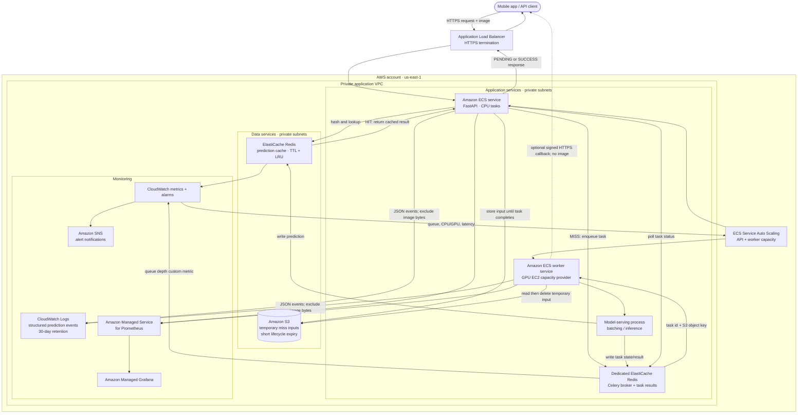

# Production architecture

**Status:** proposed AWS target architecture for `us-east-1`. It is not the topology currently running in Docker Compose. The local project has one Redis container, local temporary image files, and a prototype classifier; S3, AWS autoscaling, and 30-day CloudWatch retention are design targets.

## AWS service mapping

| Local prototype component | Proposed AWS service | Notes |
|---|---|---|
| FastAPI container | Amazon ECS service on CPU-backed tasks | Run multiple tasks behind the ALB; scale the service from request load and CPU/memory metrics. |
| Celery worker container | Amazon ECS worker service on an EC2 GPU capacity provider | GPU instance count must come from measured model throughput and batching benchmarks. The 600-slot estimate is not 600 EC2 instances. |
| Redis cache (`DB 0`) | ElastiCache for Redis OSS prediction-cache deployment | Apply the TTL and memory policy to cache entries. Keep cache eviction isolated from task messages. |
| Celery Redis broker (`DB 1`) and result backend (`DB 2`) | Separate, dedicated ElastiCache Redis deployment for Celery | Use a separate endpoint from the evictable prediction cache. The AWS ElastiCache cluster-mode choice must match the Redis database-index configuration; cluster-mode-enabled Redis is limited to database 0. [AWS cluster-mode guidance](https://docs.aws.amazon.com/AmazonElastiCache/latest/dg/modify-cluster-mode.html) |
| `./data/uploads` temporary files | Amazon S3 temporary-input bucket | Store only cache-miss inputs; delete after task completion and set a lifecycle expiration as a cleanup backstop. Do not retain images for the 30-day log requirement. |
| Docker Compose / local load balancer | Application Load Balancer + Amazon ECS | ALB is public; API, Redis, S3 access, and GPU workers remain private to the VPC. |
| Prometheus + Grafana containers | Amazon Managed Service for Prometheus + Amazon Managed Grafana | CloudWatch can also provide service metrics and dashboards; select one production monitoring path and include it in the final cost estimate. |
| Container/application logs | CloudWatch Logs | Emit structured prediction events without image data and configure 30-day log-group retention. This retention is a design target; the local app does not currently write these records to CloudWatch. |
| Prometheus alerts / service alarms | CloudWatch alarms + Amazon SNS (or Alertmanager for AMP) | Route actionable alerts to an agreed notification channel. |
| `.env` settings | AWS Secrets Manager or Systems Manager Parameter Store | Inject secrets at task startup; do not bake them into images or source control. |

## Scaling and capacity notes

- At 1,000 requests/sec and a 60% cache-hit rate, the assumed miss rate is 400 inferences/sec. At 1.5 seconds each, Little’s Law gives about 600 in-flight inference slots. A 10× spike gives about 6,000 slots. These are workload estimates, not an instance count or a demonstrated service rate.
- Scale the API and GPU worker services independently. Use queue depth and task wait time alongside request rate and CPU/GPU utilization. ECS service autoscaling can change the desired task count from CloudWatch metrics; Redis queue depth requires publishing a custom metric. [ECS service autoscaling](https://docs.aws.amazon.com/AmazonECS/latest/developerguide/service-autoscaling.html)
- If the worker fleet cannot drain work within the latency objective, apply admission control and return 429/503 responses rather than allowing an unbounded backlog.
- The local load test measured roughly 32–34 requests/sec and does not establish the 1,000 requests/sec target. Benchmark the real model, GPU type, batch size, and serving stack before fixing production capacity or cost.

## Current implementation boundary

The Docker prototype implements the API, Redis cache, Celery worker, Flower, Prometheus, and Grafana. Its classifier currently returns a fixed sample prediction after a 1.5-second delay. The AWS resources shown above—including S3, CloudWatch retention, IAM/VPC controls, and autoscaling—are proposed deployment components, not resources provisioned by this repository.
